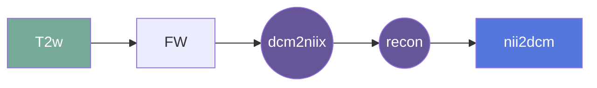

# nii2dcm
This gear tags files following dcm2niix conversion for visual QC reader tasks

## Overview

[Usage](#usage)

[FAQ](#faq)

### Summary

### Cite

**license:**
MIT License  

**url:** 

**cite:**  

### Classification

*Category:* analysis

*Gear Level:*

* [ ] Project
* [ ] Subject
* [ ] Session
* [x] Acquisition
* [ ] Analysis

----

### Inputs

* api-key
  * **Name**: api-key
  * **Type**: object
  * **Optional**: true
  * **Classification**: api-key
  * **Description**: Flywheel API key.

### Config

* input
  * **Name**: input
  * **Type**: file
  * **Optional**: false
  * **Description**: Input file to be tagged

### Outputs

#### Metadata

No metadata currently created by this gear

### Pre-requisites

- dicom2niix

#### Prerequisite Gear Runs

1. ***dcm2niix***
    * Level: Any
2. ***file-metadata-importer***
    * Level: Any
3. ***file-classifier***
    * Level: Any

#### Prerequisite

## Usage

This section provides a more detailed description of the gear, including not just WHAT
it does, but HOW it works in flywheel

### Description

This gear is designed to tag files following dcm2niix conversion for visual QC reader tasks

#### File Specifications

This section contains specifications on any input files that the gear may need

### Workflow

A picture and description of the workflow

Description of workflow

1. Upload data to container
2. Prepare data by running the following gears:
   1. 

### Use Cases

## FAQ

[FAQ.md](FAQ.md)

## Contributing

[For more information about how to get started contributing to that gear,
checkout [CONTRIBUTING.md](CONTRIBUTING.md).]
